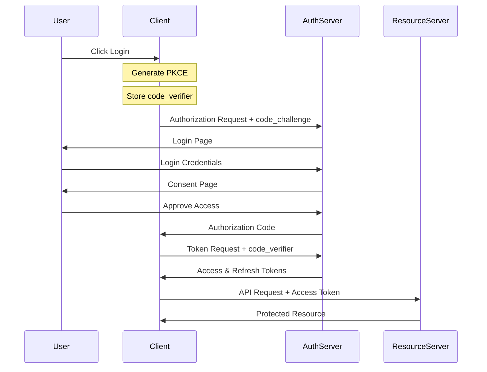
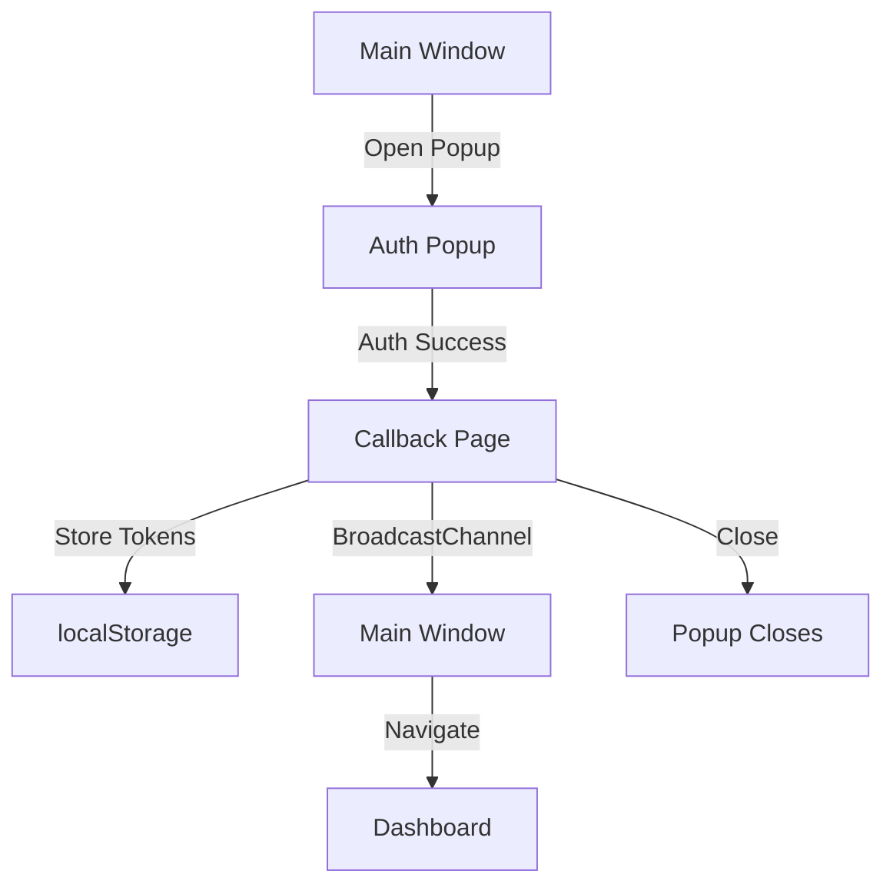
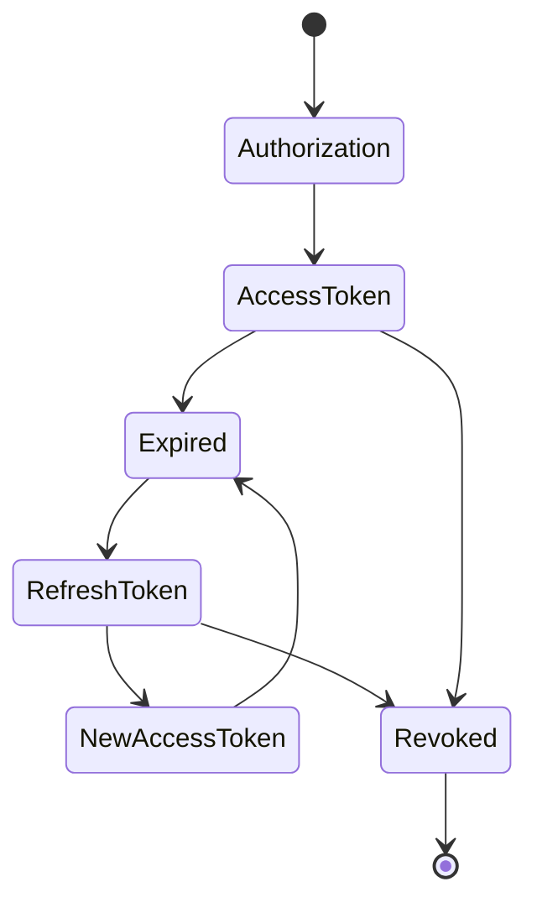

# OAuth2 OIDC PKCE

A full-stack demonstration of OAuth2 authorization code flow with PKCE (Proof Key for Code Exchange) support. This project includes both a Django-based OAuth2 provider server and a React-based client application.

## Features

- OAuth2 Authorization Code Flow with PKCE
- OpenID Connect (OIDC) support
- JWT Access Tokens
- Refresh Token support
- User authentication and registration
- Token introspection and revocation
- Modern UI with Tailwind CSS and shadcn/ui components

## Tech Stack

### Backend

- Django 5.1
- Django OAuth Toolkit
- Django REST Framework
- PostgreSQL
- JWT for token signing

### Frontend

- React 18
- TypeScript
- Vite
- TanStack Query
- Tailwind CSS
- shadcn/ui components

## Authentication Flow Diagram



## Window Communication Flow



## Token Lifecycle



## Getting Started

1. Clone the repository:

```bash
git clone https://github.com/rezashahnazar/oauth2-pkce-demo.git
cd oauth2-pkce-demo
```

2. Set up the backend:

```bash
# Create and activate a virtual environment
python -m venv venv
source venv/bin/activate  # On Windows: .\venv\Scripts\activate

# Install dependencies
pip install -r requirements.txt

# Create .env file with required variables
cp .env.example .env

# Run migrations
python manage.py migrate

# Create a superuser
python manage.py createsuperuser

# Start the development server
python manage.py runserver
```

3. Set up the frontend:

```bash
cd frontend

# Install dependencies
pnpm install

# Start the development server
pnpm dev
```

4. Create an OAuth2 application:
   - Visit `http://localhost:8000/admin`
   - Log in with your superuser credentials
   - Navigate to OAuth2 Provider > Applications
   - Create a new application with:
     - Client Type: Public
     - Authorization Grant Type: Authorization code
     - Redirect URIs: http://localhost:5173/callback

## Environment Variables

### Backend (.env)

```plaintext
DJANGO_SECRET_KEY=your-secret-key
DEBUG=True

POSTGRES_DB=your-db-name
POSTGRES_USER=your-db-user
POSTGRES_PASSWORD=your-db-password
POSTGRES_HOST=localhost
POSTGRES_PORT=5432
```

### Frontend (.env)

```plaintext
VITE_OAUTH_CLIENT_ID=<client_id>
VITE_OAUTH_CLIENT_SECRET=<client_secret>
VITE_FRONTEND_URL=http://localhost:5173
VITE_BACKEND_URL=http://localhost:8000
```

## API Endpoints

### OAuth2 Endpoints

- Authorization: `/o/authorize/`
- Token: `/o/token/`
- Revoke Token: `/o/revoke/`
- Introspect Token: `/o/introspect/`
- UserInfo (OIDC): `/o/userinfo/`

### Account Management

- Sign Up: `/accounts/signup/`
- Login: `/accounts/login/`
- Logout: `/accounts/logout/`

## Detailed Authentication Flow

### 1. Initial Authorization Request

When user clicks "Log in with OAuth2", the following occurs:

```8:36:frontend/src/pages/Home.tsx
  const handleLogin = async () => {
    const authUrl = await getAuthorizationUrl(true);
    const width = 500;
    const height = 700;
    const left = window.screenX + (window.outerWidth - width) / 2;
    const top = window.screenY + (window.outerHeight - height) / 2;

    // Create broadcast channel for cross-window communication
    const authChannel = new BroadcastChannel("auth-channel");

    authChannel.onmessage = (event) => {
      if (event.data.type === "AUTH_SUCCESS") {
        authChannel.close();
        navigate("/dashboard");
      }
    };

    const popup = window.open(
      authUrl,
      "OAuth Login",
      `width=${width},height=${height},left=${left},top=${top},toolbar=0,location=0,menubar=0,status=0,scrollbars=1`
    );

    if (!popup) {
      console.error("Popup was blocked");
      authChannel.close();
      return;
    }
  };
```

### 2. Authorization Server Processing

The Django authorization server handles the request:

```13:86:oauth2_server/views.py
class AuthorizationView(BaseAuthorizationView, LoginRequiredMixin):
    template_name = "oauth2_server/authorize.html"
    login_url = "/accounts/login/"

    def get_scopes(self):
        # Get scopes from the request query parameters
        scope_string = self.request.GET.get("scope", "")
        if not scope_string and hasattr(self, "oauth2_data"):
            # Fallback to oauth2_data if available
            scope_string = self.oauth2_data.get("scope", "")
        return scope_string.split() if scope_string else []

    def get_context_data(self, **kwargs):
        context = super().get_context_data(**kwargs)

        # Get the application
        application = None
        try:
            application = get_application_model().objects.get(
                client_id=self.oauth2_data.get("client_id")
            )
            context["application"] = application
        except get_application_model().DoesNotExist:
            pass

        scopes = self.get_scopes()

        scope_descriptions = {
            "openid": "Access your basic profile information",
            "profile": "Access to your full profile details",
            "email": "Access your email address",
        }

        context["scopes_descriptions"] = [
            scope_descriptions.get(scope, scope) for scope in scopes
        ]
        return context
    @transaction.atomic
    def form_valid(self, form):
        try:
            credentials = {
                "client_id": form.cleaned_data.get("client_id"),
                "redirect_uri": form.cleaned_data.get("redirect_uri"),
                "response_type": form.cleaned_data.get("response_type", None),
                "state": form.cleaned_data.get("state", None),
                "scope": form.cleaned_data.get("scope", None),
                "code_challenge": form.cleaned_data.get("code_challenge", None),
                "code_challenge_method": form.cleaned_data.get(
                    "code_challenge_method", None
                ),
            }

            allow = form.cleaned_data.get("allow", False)
            if not allow:
                redirect_url = self.error_response(credentials, "access_denied")
                return HttpResponseRedirect(redirect_url)

            # Convert scopes list to space-separated string if needed
            scopes = self.get_scopes()
            if isinstance(scopes, list):
                scopes = " ".join(scopes)

            uri = self.create_authorization_response(
                request=self.request,
                scopes=scopes,  # Now passing a string instead of a list
                credentials=credentials,
                allow=True,
            )[0]
            return HttpResponseRedirect(uri)

        except OAuthToolkitError as error:
            redirect_url = self.error_response(error.credentials, error.error)
            return HttpResponseRedirect(redirect_url)
```

### 3. Token Exchange

After receiving the authorization code:

```34:61:frontend/src/lib/oauth2-config.ts
export async function exchangeCodeForTokens(code: string, isPopup = false) {
  const codeVerifier = localStorage.getItem("code_verifier");
  if (!codeVerifier) throw new Error("No code verifier found");

  const response = await fetch(OAUTH2_CONFIG.tokenEndpoint, {
    method: "POST",
    headers: {
      "Content-Type": "application/x-www-form-urlencoded",
      Authorization:
        "Basic " +
        btoa(`${OAUTH2_CONFIG.clientId}:${OAUTH2_CONFIG.clientSecret}`),
    },
    body: new URLSearchParams({
      grant_type: "authorization_code",
      code,
      redirect_uri: isPopup
        ? `${import.meta.env.VITE_FRONTEND_URL}/callback?popup=true`
        : OAUTH2_CONFIG.redirectUri,
      code_verifier: codeVerifier,
    }),
  });

  if (!response.ok) {
    throw new Error("Failed to exchange code for tokens");
  }

  return response.json();
}
```

### 4. User Information Retrieval

After obtaining tokens:

```63:75:frontend/src/lib/oauth2-config.ts
export async function getUserInfo(accessToken: string) {
  const response = await fetch(OAUTH2_CONFIG.userinfoEndpoint, {
    headers: {
      Authorization: `Turbo ${accessToken}`,
    },
  });

  if (!response.ok) {
    throw new Error("Failed to fetch user info");
  }

  return response.json();
}
```

## Security Considerations

- PKCE is enforced for all authorization code flows
- JWT tokens are signed using RSA keys
- Access tokens expire after 1 hour
- Refresh tokens expire after 24 hours
- CORS is configured for local development
- SSL/TLS should be enabled in production
- Secure cross-window communication using BroadcastChannel API
- Automatic token cleanup and window management

## Error Handling

The authentication flow handles various scenarios:

- Popup blocked by browser
- Authentication timeout
- Network failures
- Invalid tokens
- Authorization denied
- Server-side errors

## Contributing

1. Fork the repository
2. Create your feature branch (`git checkout -b feature/amazing-feature`)
3. Commit your changes (`git commit -m 'Add some amazing feature'`)
4. Push to the branch (`git push origin feature/amazing-feature`)
5. Open a Pull Request

## License

This project is licensed under the MIT License - see the LICENSE file for details.

## Author

Reza Shahnazar - [GitHub](https://github.com/rezashahnazar) - [Email](mailto:reza.shahnazar@gmail.com)
